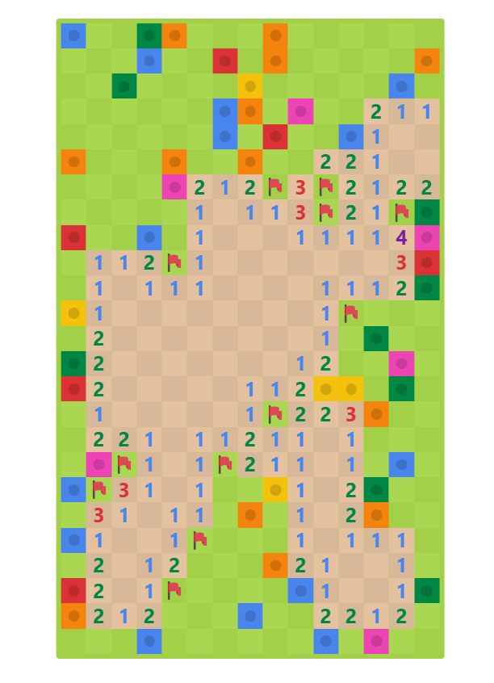

# **Minesweeper Game**

 
 
 
 

___
    
My project is a **Minesweeper** game. The [source]() was the built-in Minesweeper game in Google Games. The project was originally created using [create_react_app](https://create-react-app.dev)

____

**<h2 align='center'>Project appearance</h2>**

____

**<h2 align='center'>Stack</h2>**

The project is mainly written on [React](https://reactjs.org/) technology. In particular, I came across the following concepts:

- **React hooks:**
  - useState
  - useCalender
- **Typescript:**
  - Generic Types
  - Interfaces
  - Type for component properties
- **Dynamically added components and classes for components**
- **Classes for Board and Cell with own propertis ad methods**